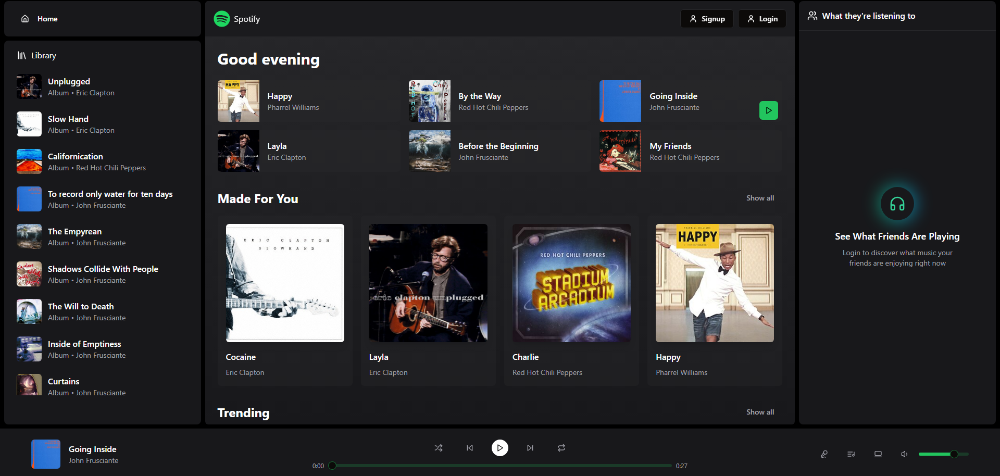

# 🎵 Online Music App — Mobile
Mobile part of online music streaming service built with React Native + Expo.


<div align="middle">
  
  
  
  
</div>

## Features
* Songs, albums, artists, playlists, favorites
* Music player that works in background (on lock screen, notifications)
* Tracks searching by name and artist

## Installation

```bash
npm install
```

## Run Android

```bash
npx expo run:android
```